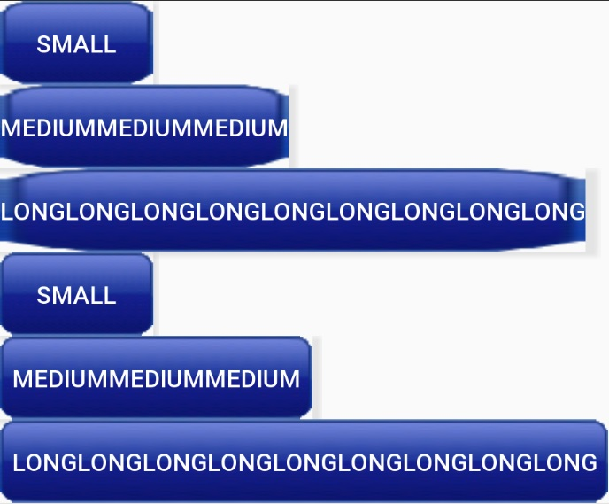
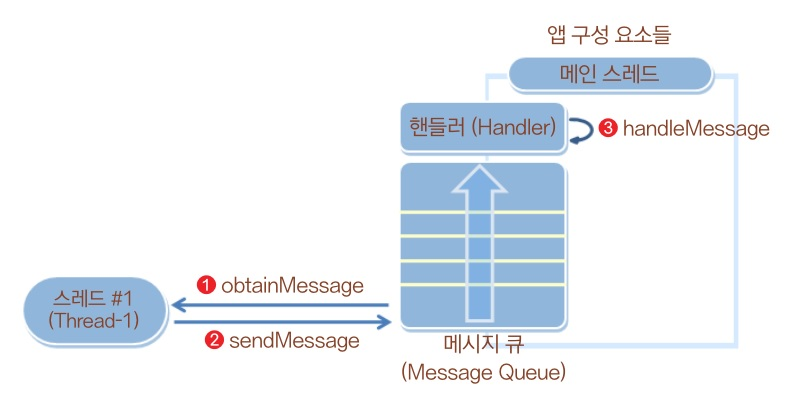
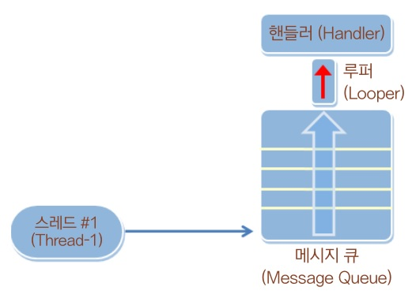
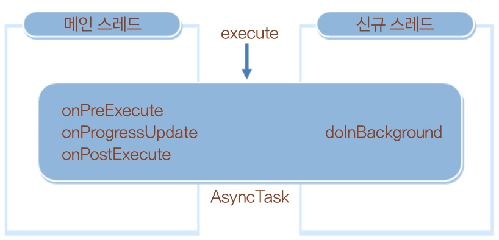
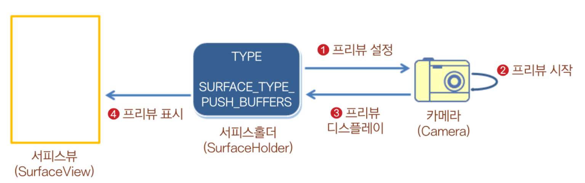

# 📕 Do it! Android App Programming

## 레이아웃

레이아웃 이름        | 설명
-|-
Constraint Layout   | 제약조건 사용
LinearLayout        | 한 쪽 방향으로 뷰 추가
RelativeLayout      | 부모 컨테이너나 다른 뷰와의 상대적 위치로 화면을 구성, Constraint를 사용하게 되면서 권장하지 않음
FrameLayout         | 여러 개의 뷰를 중첩하여 가장 상위의 뷰만 보여줌
TableLayout         | 격자 모양의 배열을 사용

### - LinearLayout

- orientation: 필수 속성

#### 뷰 정렬하기

속성            | 설명
-|-
layout_gravity  | 부모 컨테이너의 여유 공간에 뷰가 채워지지 않아 여유 공간이 생겼을 때 여유 공간 안에서 뷰를 정렬
gravity         | 뷰 안에 표시하는 내용물을 정렬

- baselineAligned: 텍스트 우선 정렬

- layout_weight

- 정확한 비율로 설정할 경우 width나 weight를 0으로 설정해야함

### - RelativeLayout

속성            | 설명
-|-
layout_above        | 지정한 뷰의 위쪽에 배치
layout_below        | 지정한 뷰의 아래쪽에 배치
layout_toLeftOf     | 지정한 뷰의 왼쪽에 배치
layout_toRightOf    | 지정한 뷰의 오른쪽에 배치
layout_alignTop     | 지정한 뷰의 위쪽과 맞춤
layout_alignBottom  | 지정한 뷰의 아래쪽과 맞춤
layout_alignLeft    | 지정한 뷰의 왼쪽과 맞춤
layout_alignRight   | 지정한 뷰의 오른쪽과 맞춤

### - TableLayout

- 최상위 레이아웃이 될 수 없음
- stretchColumns
- shrinkColumns
- layout_column
- layout_span

### - FrameLayout

- 중첩(Overlay)  
- 가시성(Visibility)  

### - ScrollView

- HorizontalScrollView  
- VerticalScrollView

## 기본 위젯

### TextView

- #### 다국어 지원 방법

리소스에 공통으로 적용되는 병렬 리소스 로딩(Parallel Resource Loading) 방식을 사용

```
/app/res
    values-en/  <-- 영어 지원
        strings.xml
    values-ko/  <-- 한글 지원
        strings.xml
```

- #### textColor

`#AARRGGBB` - 각각 Alpha, Red, Green, Blue를 의미  
Alpha - 불투명(FF), 투명(00)  

- #### textSize

textSize는 sp단위 사용 권장

### Button

- #### RadioButton

RadioGroup 안에 정의

- #### CheckBox

### EditText

- #### inputType

입력하는 문자의 유형을 지정

- #### hint

어떤 내용을 입력해야 할지 알림  
textColorHint로 색상 변경 가능

- #### selectAllOnFocus

true이면 포커스를 받을 때 문자열 전체가 선택됨

- #### cursorVisible

커서 가시성

- #### autoLink

하이퍼링크

- #### lineSpacingMultiplier, lineSpacingExtra

줄 간격 조정

- #### capitalize

대소문자 조절(characters, words, sentences)

- #### ellipsize

생략 부분 설정(start, middle, end)

- #### addTextChangedListener()

텍스트가 변경될 때마다 발생하는 이벤트 처리


### ImageView

- #### android:src 또는 app:srcCompat

res/drawable 에 있는 이미지 파일을 불러옴

- #### maxWidth, maxHeight

이미지의 최대 크기 지정

- #### tint

이미지뷰에 보이는 이미지의 색상 설정

- #### scaleType

이미지뷰의 크기에 맞게 원본 이미지의 크기를 원하는 형태로 조절하여 보여줄 때 사용  
fitXY, centerCrop, centerInside 등

- #### drawable 폴더

```
// 초고해상도
res/drawable-xhdpi
res/drawable-xxhdpi
res/drawable-xxxhdpi

// 고해상도
res/drawable-hdpi

// 중간 해상도
res/drawable-mdpi

// 저해상도
res/drawable-ldpi
```

## Drawable 

드로어블 | 설명
-|-
BitmapDrawable | 이미지 파일을 보여줄 때 사용
StateListDrawable | 상태별로 다른 비트맵 그래픽을 참조
TransitionDrawable | 두 개의 드로어블을 서로 전환할 수 있음
ShapeDrawable | 색상과 그라데이션을 포함하여 도형 모양을 정의할 수 있음
InsetDrawable | 지정된 거리만큼 다른 드로어블을 들어서 보여줄 수 있음
ClipDrawable | 레벨 값을 기준으로 다른 드로어블을 클리핑할 수 있음
ScaleDrawable | 레벨 값을 기준으로 다른 드러어블의 크기를 변경할 수 있음

## Event

속성 | 설명
-|-
터치 이벤트 | 화면을  손가락으로 누를 때 발생하는 이벤트
키 이벤트 | 키패드나 하드웨어 버튼을 누를 때 발생하는 이벤트
제스처 이벤트 | 터치 이벤트 중에서 스크롤과 같이 일정 패턴으로 구분되는 이벤트
포커스 | 뷰마다 순서대로 주어지는 포커스
화면 방향 변경 | 화면의 방향이 가로와 세로로 바뀜에 따라 발생하는 이벤트

### Touch Event

### Gesture Event

### Key Event

### 단말 방향 전환

## Toast, Snackbar, Dialog

### Toast

- this
- getApplicationContext()
- setGravity(): 토스트의 위치 설정
- setMargin(): 토스트의 여백 설정

### Snackbar

### Dialog

## ProgressBar

- 막대 모양
- 원 모양

## LayoutInflation

## 화면 간 전환하기

### 안드로이드 앱의 기본 구성 요소

- 액티비티
- 서비스
- 브로드캐스트
- 내용 제공자

안드로이드 시스템이 이 요소에 대한 정보를 요구

1. startActivityForResult

2. setResult

3. onActivityResult


startActivity()  
startService()  
broadcastIntent()  

인텐트의 기본 구성 요소 액션과 데이터

속성 | 설명
-|-
ACTION_DIAL tel:01077881234 | ㅈ
ACTION_VIEW tel:01077881234 | ㅈ
ACTION_EDIT content://contacts/people/2 | ㅈ
ACTION_VIEW content://contacts/people | ㅈ

MIME 타입?

명시적 인텐트  
: 인텐트에 클래스 객체나 컴포넌트 이름을 지정하여 호출할 대상을 확실히 알 수 있는 경우

암시적 인텐트  
: 액션과 데이터를 지정하긴 했지만 호출할 대상이 달라질 수 있는 경우

암시적 인텐트 속성

- 범주(Category)
- 타입(Type)
- 컴포넌트(Component)
- 부가 데이터(Extras)

### 플래그

인텐트로 인해 동일한 액티비티를 여러 번 사용하게 되는 경우를 방지

FLAG_ACTIVITY_SINGLE_TOP  
FLAG_ACTIVITY_NO_HISTORY  
FLAG_ACTIVITY_CLEAR_TOP  

#### 인텐트를 처리 방법

- 액티비티가 새로 만들어지는 경우  
onCreate() {
    getIntent()
}  

- 액티비티가 재사용되는 경우  
onNewIntent(Intent intent)

### 부가데이터

인텐트 안에는 번들 객체가 들어있음  
번들 객체는 해시테이블과 유사

putExtra()  
getStringExtra()  

전달하고 싶은 데이터가 객체 자료형인 경우 객체 자체를 전달할 수 없음  
객체 데이터는 바이트 배열로 변환하거나 Serializable 인터페이스를 구현하는 객체를 만들어 직렬화한 다음 전달해야함  
안드로이드는 Serializable 인터페이스와 유사한 Parcelable 인터페이스 권장  
직렬화했을 때 크기가 더 작기 때문


public abstract int describeContents()  
직렬화하려는 객체의 유형을 구분할 때 사용  

public abstract void writeToParcel(Parcel dest, int flags)  
객체가 가지고 있는 데이터를 Parcel 객체로 만듦

### 태스크

태스크는 앱이 어떻게 동작할 지 결정하는데 사용된다.  
즉, 태스크를 이용하면 프로세스처럼 독립적인 실행 단위와 상관없이 어떤 화면들이 같이 동작해야 하는지 흐름을 관리할 수 있다.  
프로세스는 독립적으로 실행됨  

```xml
<activity android:name=".MainActivity"
        android:launchMode="singleTop">
    <intent-filter>
        <action android:name="android.intent.action.MAIN" />
        <category android:name="android.intent.category.LAUNCHER" />
    </intent-filter>
</activity>
```

### 액티비티의 수명주기

#### 액티비티의 대표적인 상태 정보

상태 | 설명
-|-
실행(Running) | 화면상에 액티비티가 보이면서 실행되어 있는 상태. 액티비티 스택의 최상위에 있으며 포커스를 가지고 있음
일시정지(Paused) | 사용자에게 보이지만 다른 액티비티가 위에 있어 포커스를 받지 못하는 상태. 대화상자가 위에 있어 일부가 가려진 경우에 해당함.
중지(Stopped) | 다른 액티비티에 의해 완전히 가려저 보이지 않는 상태

액티비티의 상태 정보가 변화하는 것을 액티비티의 수명주기(Life Cycle) 또는 생명주기라고 함.

- 액티비티 처음 실행 시  
onCreate() -> onStart() -> onResume()

- 액티비티 전환 시(A -> B)  
A: onPause() -> onStop() -> (finish()) onDestroy()  
B: onRestart() -> onStart() -> onResume()

onSaveInstanceState()  
onRestoreInstanceState()  

### 프래그먼트

- 화면의 일부분 구성

사용 목적
- 분할된 화면들을 독립적으로 구성
- 분할된 화면들의 상태를 관리

프래그먼트는 항상 액티비티 위에 올라가있어야 함

[Fragment]

`public final Activity getActivity()`  
: 이 프래그먼트를 포함하는 액티비티 반환

`public final FragmentManager getFragmentManager()`  
: 이 프래그먼트를 포함하는 액티비티에서 프래그먼트 객체들과 의사소통하는 프래그먼트 매니저 반환

`public final Fragment getParentFragment()`  
: 이 프래그먼트를 포함하는 부모가 프래그먼트일 경우 리턴. 액티비티이면 null을 반환

`public final int getId()`  
: 이 프래그먼트의 ID를 반환

[FragmentManager]

`public abstract FragmentTransaction beginTransaction()`  
: 프래그먼트를 변경하기 위한 트랜잭션을 시작

`public abstract Fragment findFragmentById(int id)`

`public abstract Fragment findFragmentByTag(String tag)`

`public abstract boolean executePendingTransactions()`  
: 트랜잭션은 commit() 메소드를 호출하면 실행되지만 비동기 방식으로 실행되므로 즉시 실행하고 싶다면 이 메소드를 추가로 호출해야함.

`getSupprotFragmentManager()`: 예전 버전 호환  
`getFragmentManager()`

다른 프래그먼트로 변경 시 트랜잭션 사용

`supportFragmentManager.beginTransaction().replace(/* */).commit()`

#### 프래그먼트 수명주기

onAttach() - 프래그먼트가 액티비티와 연결될 때  
onCreate() - 프래그먼트가 초기화될 때  
onCreateView() - 프래그먼트와 관련되는 뷰 계층을 만들어서 반환  
onActivityCreated() - 프래그먼트와 연결된 액티비티가 onCreate() 메서드의 작업을 완료했을 때  
onStart()  
onResume()  
onPause()  
onStop()  
onDestroyView() - 프래그먼트와 관련된 뷰 리소스를 해제할 수 있도록 호출됨  
onDestroy() - 프래그먼트의 상태를 마지막으로 정리할 수 있도록 호출됨  
onDetach() - 프래그먼트가 액티비티와 연결을 끊기 바로 전에 호출됨

- 액티비티에 프래그먼트 추가  
onAttach() -> onCreate() -> onCreateView() -> onActivityCreated() -> onStart() -> onResume()

- 액티비티에서 프래그먼트 제거  
onPause() -> onStop() -> onDestroyView() -> onDestroy() -> onDetach()

- Back stack에서 복구되는 경우  
onDestroyView() -> onCreateView()

#### 중요!

- 프래그먼트는 액티비티 위에 올라가지 않고서는 프래그먼트로서 동작하지 않는다.
- 프래그먼트 객체가 new 연산자가 아니라 액티비티 위에 올라가야 동작한다.

`MyFragment fragment = new MyFragment();`  
-> 프래그먼트 객체는 만들어졌지만 프래그먼트로 동작하지는 않음

`getSupportFragmentManager().beginTransaction().add(fragment).commit();`  
-> 액티비티에 추가된 후 프래그먼트로 동작함

### 액션바

액션바: 앱의 제목이 보이는 위쪽 부분  

- 옵션 메뉴: 메뉴를 눌렀을 때 나타나는 메뉴  
- 컨텍스트 메뉴: 화면을 길게 누르면 나타나는 메뉴 

`onCreateOptionsMenu()`  
`onCreateContextMenu()`

`onOptionsItemSelected()`

/app/res/menu -> menu resource file

```xml
<menu>
    <item/>
    <item/>
    <item/>
</menu>
```

### 탭(=Navigation)

외부 라이브러리인 material 라이브러리에 존재

> /Gradle Scripts/build.gradle (Module: app)

```gradle
...
dependencies {
    ...
    implementation 'com.google.android.materal:material:1.0.0'
}
```

```xml
<CoordinatorLayout>
    <AppBarLayout>
        <Toolbar>
        </Toolbar>
        <TabLayout>
        </TabLayout>
    </AppBarLayout>
    <FrameLayout>
    </FrameLayout>
</CoordinatorLayout>
```

```java
public class Fragment1 extends Fragment {
    @Override
    public View onCreateView(LayoutInflater inflater, ViewGroup container, Bundle savedInstanceState) {
        return inflater.inflate(R.layout.fragment1, container, false);
    }
}
```

```java
public class MainActivity extends AppCompatActivity {
    Fragment1 fragment1;
    Fragment2 fragment2;
    Fragment3 fragment3;

    @Override
    protected void onCreate(Bundle savedInstanceState) {
        super.onCreate(savedInstanceState);
        setContentView(R.layout.activity_main);

        fragment1 = new Fragment1();
        fragment2 = new Fragment2();
        fragment3 = new Fragment3();

        getSupportFragmentManager().beginTransaction().replace(R.id.container, fragment1).commit();
    }
}
```

### 하단 탭(=Bottom Navigation)

```xml
<?xml version="1.0" encoding="utf-8"?>
<menu
    xmlns:android="http://schemas.android.com/apk/res/android"
    xmlns:app="http://schemas.android.com/apk/res-auto">

    <item
        android:id="@+id/tab1"
        android:title="첫번째" />

    <item
        android:id="@+id/tab2"
        android:title="두번째"/>

    <item
        android:id="@+id/tab3"
        android:title="세번째"/>

</menu>
```

```xml
<com.google.android.material.bottomnavigation.BottomNavigationView
    android:id="@+id/bottom_navigation"
    android:layout_width="match_parent"
    android:layout_height="wrap_content"

    app:layout_constraintBottom_toBottomOf="parent"
    app:layout_constraintLeft_toLeftOf="parent"
    app:layout_constraintRight_toRightOf="parent"

    app:itemBackground="@color/colorPrimary"
    app:menu="@menu/menu_bottom"/>
```

### 뷰페이저(ViewPager)

```xml
<androidx.viewpager.widget.ViewPager
    android:id="@+id/pager"
    android:layout_width="match_parent"
    android:layout_height="match_parent"/>
```

```java
public class MainActivity extends AppCompatActivity {
    ViewPager pager;
    
    @Override
    protected void onCreate(Bundle savedInstanceState) {
        super.onCreate(savedInstanceState);
        setContentView(R.layout.activity_main);

        pager = findViewById(R.id.pager);
        pager.setOffscreenPageLimit(3);

        MyPagerAdapter adapter = new MyPagerAdapter(getSupportFragmentManager());
        Fragment1 fragment1 = new Fragment1();
        Fragment2 fragment2 = new Fragment2();
        Fragment3 fragment3 = new Fragment3();
    
        adapter.addItem(fragment1);
        adapter.addItem(fragment2);
        adapter.addItem(fragment3);

        pager.setAdapter(adapter);
    }

    class MyPagerAdapter extends FragmentStatePagerAdapter {
        ArrayList<Fragment> items = new ArrayList<Fragment>();

        public MyPagerAdapter(FragmentManager fm) {
            super(fm);
        }

        public void addItem(Fragment item) {
            items.add(item);
        }

        @Override
        public Fragment getItem(int position) {
            return items.get(position);
        }

        @Override
        public int getCount() {
            return items.size();
        }
    }
}
```

### NavigationDrawer

바로가기 메뉴: 화면의 좌측 상단에 위치한 햄버거 모양을 눌렀을 때 나타나는 화면

```xml
<DrawerLayout>
    <CoordinatorLayout>
        <AppBarLayout>
            <Toolbar>
            </Toolbar>
        </AppBarLayout>
        <FrameLayout>
        </FrameLayout>
    </CoordinatorLayout>
    <NavigationView>
    </NavigationView>
</DrawerLayout>
```


## 서비스

서비스: 백그라운드에서 실행되는 앱의 구성 요소

- 서비스 실행  

```
메인 액티비티 -(startService() 메서드 호출)→ *서비스*(onCreate() 호출됨)  
                                              |
/* 서비스는 실행된 상태를 계속 유지하기 위해   비정상 종료(onDestroy() 호출됨)
   서비스가 비정상적으로 종료되더라도            ↓
   시스템이 자동으로 재실행합니다. */         시스템 -자동 재시작→ *서비스*
```

- `startService()` 호출 시 인텐트 객체를 파라미터로 전달  
    - 인텐트 객체는 어떤 서비스를 실행할 것인지에 대한 정보를 담고 있음  
    - 시스템은 서비스를 시작시킨 후 인텐트 객체를 서비스에 전달  
- 서비스가 실행 중이면 `startService()`를 여러 번 호출해도 이미 메모리에 만들어진 상태로 유지  
- 따라서 `startService()`는 *서비스를 시작하는 목적* 이외에 *인텐트를 전달하는 목적*으로 자주 사용
- 인텐트 전달 시 `onCreate()`가 아니라 `onStartCommand()` 실행
    - `onStartCommand()`는 서비스로 전달된 인텐트 객체를 처리  
- 서비스에서 액티비티로 데이터 전달
    - 서비스에서 `startActivity()` 사용
    - FLAG_ACTIVITY_NEW_TASK: 서비스는 화면이 없기 때문에, 화면이 있는 액티비티를 띄우려면 새로운 태스크를 만들어야 한다.
    - FLAG_ACTIVITY_SINGLE_TOP, FLAG_ACTIVITY_CLEAR_TOP: MainActiviy 객체가 이미 메모리에 만들어져 있을 때 재사용
    - MainActivity에서 인텐트 객체 참조 시
        - MainActivity가 메모리에 만들어져 있지 않은 상태: `onCreate()` 호출(`getIntent()`로 전달받음)
        - MainActivity가 메모리에 만들어져 있는 상태: `onNewIntent()` 호출(파라미터로 전달받음)
- 서비스 종료
    - `stopService()` 사용
- 예) 서버에 데이터를 요청하고 응답을 기다리는 네트워킹 작업

## 브로드캐스트 수신자(Broadcast Receiver)

브로드캐스팅(Broadcasting): 메시지를 여러 객체에 전달하는 것  
예) 카카오톡 그룹 채팅방에서 메시지 전달, 안드로이드 앱 구성 요소에 메시지 전달

브로드캐스트 수신자를 등록하면 액티비티 안에서 브로드캐스트 메시지를 전달받아 다른 작업 수행 가능

`onReceive()`: 원하는 브로드캐스트 메시지가 도착하면 자동으로 호출됨

```xml
<manifest>
    <!-- SMS 수신 권한 -->
    <uses-permission android:name="android.permission.RECEIVE_SMS" />
    <application>
        <receiver>
            <intent-filter>
                <action android:name="android.provider.Telephony.SMS_RECEIVED" />
                <!--
                    SMS 메시지가 들어간 인텐트를 구분하기 위한 액션 정보
                    단말에서 SMS를 수신했을 때 이 action 정보가 들어간 인텐트를 전달함
                -->
            </intent-filter>
        </receiver>
    </application>
</manifest>
```

## 위험 권한 부여하기

마시멜로(API 23)부터는 중요한 권한들을 분류하여 설치 시점이 아니라 앱을 실행했을 때 사용자로부터 권한을 부여받도록 변경되었음  

일반 권한 - 설치 시  
위험 권환 - 실행 시  

위험 권한 분류
- 위치
- 카메라
- 마이크
- 연락처
- 전화
- 문자
- 일정
- 센서

```kt
val permissions: Array<String> = arrayOf(   // 위험 권한 부여할 권한 지정
    Manifest.permission.READ_EXTERNAL_STORAGE,
    ...
)
        val targetList: ArrayList<String> = ArrayList<String>()

        for (i in permissions.indices) {
            val curPermission = permissions[i]
            val permissionCheck = ContextCompat.checkSelfPermission(this, curPermission)

            if (permissionCheck == PackageManager.PERMISSION_GRANTED) {
                Toast.makeText(this, "$curPermission 권한 있음.", Toast.LENGTH_LONG).show()
            } else {
                Toast.makeText(this, "$curPermission 권한 없음.", Toast.LENGTH_LONG).show()
                if (ActivityCompat.shouldShowRequestPermissionRationale(this, curPermission)) {
                    Toast.makeText(this, "$curPermission 권한 설명 필요함.", Toast.LENGTH_LONG).show()
                } else {
                    targetList.add(curPermission)
                }
            }
        }

        val targets: Array<String> = Array(targetList.size) { "" }
        targetList.toArray(targets)

        ActivityCompat.requestPermissions(this, targets, 101)   // 위험 권한 부여 요청
```

## 리소스(Resource)

/app/assets  
: 에셋(Asset)은 동영상이나 웹페이지와 같은 용량이 큰 데이터를 의미

/app/res  
: 리소스는 빌드되어 설치 파일에 추가

리소스가 갱신되면 리소스의 정보가 R.java 파일에 자동으로 기록  

/app/res/values  
: 문자열이나 기타 기본 데이터 타입에 해당하는 정보들

/app/res/drawable  
: 이미지 저장

Resources 객체 참조 -> `Context.getResources()`

## 그래들(Gradle)

그래들: 빌드 및 배포 도구

build.gradle  
- 프로젝트 수준  
- 모듈 수준  

build.gradle (Project: ~)  
: 프로젝트 안에 들어있는 모든 모듈에 적용되는 설정을 담고 있음  

build.gradle (Module:app)  
: 각각의 모듈에 대한 설정을 담고 있음  

applicationId  
: 앱의 id값(전 세계에서 유일한 값)  
compileSdkVersion  
: 사용할 SDK 버전(보통 최신 버전)  
minSdkVersion  
: 지원가능한 최소 하위 버전  
targetSdkVersion  
: 검증된 SDK 버전  
dependencies  
: 외부 라이브러리 추가 가능  
implementation  
: 추가한 외부 라이브러리


settings.gradle  
: 어떤 모듈을 포함할 것인지에 대한 정보가 들어있음

```gradle
include ':app'
```

local.properties  
: PC에 설치된 SDK 위치  

gradle.properties  
: 메모리 설정

gradle-wrapper.properties  
: 그래들 버전 정보

## 선택 위젯 만들기

### 나인패치(Nine Patch)

이미지 확대 및 축소로 인해 이미지 왜곡을 해결하는 방법

`button_image.png`  
`button_image.9.png`  



### 새로운 뷰 만들기

- `public void onMeasure(int widthMeasureSpec, int heightMeasureSpec)`  
    - 뷰가 스스로 크기를 정할 때 자동으로 호출
- `public void onDraw(Canvas canvas)`  
    - 스스로를 레이아웃에 맞게 그릴 때 자동으로 호출

onDraw(): 화면에 그림  
invalidate(): onDraw()를 호출하여 다시 그림  

### 카드뷰(CardView)

카드뷰(CardView): 프로필과 같은 간단 정보를 넣기 위해 각 영역을 구분하는 역할을 함  
- 외부 라이브러리 사용

```xml
<androidx.cardview.widget.CardView
    android:layout_width="match_parent"
    android:layout_height="wrap_content"
    app:cardBackgroundColor="#FFFFFFFF"
    app:cardCornerRadius="10dp"
    app:cardElevation="5dp"
    app:cardUseCompatPadding="true">
    ...
    <View>
    ...
</androidx.cardview.widget.CardView>
```

### 리싸이클러뷰(RecyclerView)

선택 위젯(Selection Widget): 여러 개의 아이템 중에 하나를 선택할 수 있는 리스트 모양의 위젯  
- 어댑터(Adapter) 패턴 사용

리싸이클러뷰: 리스트 모양으로 보여줄 수 있는 위젯
- 상하, 좌우 스크롤 가능
- 각각의 아이템이 화면에 보일 때 메모리를 효율적으로 사용하도록 캐시 메커니즘이 구현되어 있음
- 리스트뷰보다는 리싸이클러뷰 권장(장점이 더 많음)
- 외부 라이브러리 사용  

_Adapter.kt_

```kotlin
class Item(var name: String, var age: String)
class Adapter : RecyclerView.Adapter<Adapter.ViewHolder> {
    var items: ArrayList<Item> = ArrayList()

    class ViewHolder(itemView: View) : RecyclerView.ViewHolder(itemView) {
        var textView01: TextView? = null
        var textView02: TextView? = null

        init {
            textView01 = itemView.findViewById(R.id.textView01)
            textView02 = itemView.findViewById(R.id.textView02)
        }

        fun setItem(item: Item) {
            textView01?.text = item.name
            textView02?.text = item.age
        }
    }

    override fun onCreateViewHolder(parent: ViewGroup, viewType: Int): ViewHolder {
        val inflater: LayoutInflater = LayoutInflater.from(parent.context)
        val itemView: View = inflater.inflate(R.layout.client_information, parent, false)

        return ViewHolder(itemView)
    }

    override fun getItemCount(): Int {
        return items.size
    }

    override fun onBindViewHolder(holder: ViewHolder, position: Int) {
        val item: Client = items[position]
        holder.setItem(item)
    }

    fun addItem(item: Item) {
        items.add(item)
    }
}
```

_MainActivity.kt_

```kotlin
class MainActivity : AppCompatActivity() {
    override fun onCreate(savedInstanceState: Bundle?) {
        super.onCreate(savedInstanceState)
        setContentView(R.layout.activity_main)

        val recyclerView: RecyclerView = findViewById(R.id.recyclerview)
        val layoutManager: LinearLayoutManager = LinearLayoutManager(this, LinearLayoutManager.VERTICAL, false)
        val adapter: Adapter = Adapter()

        recyclerView.layoutManager = layoutManager
        recyclerView.adapter = adapter

        val button: Button = findViewById(R.id.button)
        button.setOnClickListener {
            adapter.addItem(Client(name, birth, phone))
            adapter.notifyDataSetChanged()
        }
    }
}
```

`RecyclerView`
- `RecyclerView.Adapter<RecyclerView.ViewHolder>`: 특정 데이터 셋으로부터 리싸이클러뷰 안에 보여지는 뷰들로 바인딩을 제공
    - `onCreateViewHolder()`: 새로운 ViewHolder가 생성될 때 호출됨
    - `getItemCount()`: 어댑터의 데이터 셋 안에 있는 아이템들의 총 개수
    - `onBindViewHolder()`: 특정 위치에 있는 데이터를 보여주기 위해 호출됨
- `RecyclerView.ViewHolder`: 리싸이클러뷰 내의 한 아이템 뷰 및 메타데이터를 설명
- `RecyclerView.setLayoutManager`: 리싸이클러뷰 내의 아이템 뷰들을 측정하고 배치하는 레이아웃 관리자 설정
    - `LinearLayoutManager`
    - `GridLayoutManager`
- `RecyclerView.setAdapter`


### 스피너(Spinner)

여러 아이템 중에서 하나를 선택하는 전형적인 위젯  
윈도우의 콤보 박스(Select Box)와 유사  
Spinner를 터치하면 기타 모든 사용 가능한 값을 포함하는 드롭다운 메뉴가 표시되며, 여기서 새 값을 선택 가능  

- __`Spinner`__
    - `setAdapter`
    - `setOnItemSelectedListener`

- __`ArrayAdapter<?>`__  
    - `setDropDownViewResource`

- __`AdapterView.OnItemSelectedListener`__
    - `onNothingSelected`
    - `onItemSelected`

## 애니메이션 사용하기

1. 애니메이션 동작 정보 XML로 작성
2. XML을 로딩하여 애니메이션 객체 생성
3. 뷰에 애니메이션 적용

### 확대/축소

`scale.xml`

```xml
<set xmlns:android="http://schemas.android.com/apk/res/android">
    <scale
        android:duration="2500"
        android:pivotX="50%"
        android:pivotY="50%"
        android:fromXScale="1.0"
        android:fromYScale="1.0"
        android:toXScale="2.0"
        android:toYScale="2.0" />
    <scale
        android:startOffset="2500"
        android:duration="2500"
        android:pivotX="50%"
        android:pivotY="50%"
        android:fromXScale="1.0"
        android:fromYScale="1.0"
        android:toXScale="2.0"
        android:toYScale="2.0" />
</set>
```

`MainActivity.kt`

```kotlin
button.setOnClickListener {
    val animation: Animation = AnimationUtils.loadAnimation(applicationContext, R.anim.scale)
    it.startAnimation(animation)
}
```

### 이동

`translate.xml`

```xml
<translate xmlns:android="http://schemas.android.com/apk/res/android"
    android:fromXDelta="0%p"
    android:toXDelta="-100%p"
    android:duration="20000"
    android:repeatCount="-1"
    android:fillAfter="true" />
```

### 회전

`rotate.xml`

```xml
<rotate xmlns:android="http://schemas.android.com/apk/res/android"
    android:fromDegrees="0"
    android:toDegrees="0"
    android:pivotX="50%"
    android:pivotY="50%"
    android:duration="10000" />
```

### 투명도

`alpha.xml`

```xml
<alpha xmlns:android="http://schemas.android.com/apk/res/android"
    android:fromAlpha="0.0"
    android:toAlpha="1.0"
    android:duration="10000" />
```

## 페이지 슬라이딩 사용하기

레이아웃에 애니메이션을 사용할 수 있다.

`Animation.AnimationListener` 인터페이스 구현
- `onAnimationEnd()`: 애니메이션이 끝날 때 동작 구현
- `onAnimationStart()`: 애니메이션이 시작할 때 동작 구현
- `onAnimationRepeat()`: 애니메이션이 반복될 때 동작 구현

## 앱 화면에 웹브라우저 넣기

앱에서 웹사이트를 띄우는 방법
- 앱 화면엔 웹 브라우저 띄우기: 인텐트 객체를 만들어서 웹사이트 주소를 넣은 후 시스템으로 요청
- 앱 화면에 웹 브라우저 넣기: 웹뷰(WebView) 사용
    - 인터넷 접속 권한 등록  

    ```xml
    <uses-permission android:name="android.permission.INTERNET"/>
    ```

    - XML 레이아웃에 웹뷰 추가

    ```xml
    <WebView
        android:id="@+id/webView"
        android:layout_width="match_parent"
        android:layout_height="match_parent" />
    ```

    - 설정

    ```kt
    val webView: WebView = findViewById(R.id.webView)

    // 웹뷰의 설정 수정하기
    val webSettings: WebSettings = webView.settings
    webSettings.javaScriptEnabled = true

    webView.webViewClient = ViewClient()

    // 사이트 로딩하기
    webView.loadUrl(/* web site address */)

    // WebView 객체에 웹페이지를 보여주기 위함
    private class ViewClient : WebViewClient() {
        override fun shouldOverrideUrlLoading(view: WebView?, url: String?): Boolean {
            view?.loadUrl(url)

            return true
        }
    }
    ```

    - 속성 추가(웹뷰 안에 웹사이트 표시 위함)

    ```xml
    <uses-permission android:name="android.permission.INTERNET"/>
    <application
        android:usesCleartextTraffic="true"
        ...
    ```

## 시크바(SeekBar)

프로그레스바처럼 사용할 수 있는 대표적인 상태 표시 위젯  
프로그레스바를 확장하여 만든 것, 사용자가 값을 조정할 수 있음

### `OnSeekBarChangeListener`

- `onStartTrackingTouch(seekBar: SeekBar)`
- `onStopTrackingTouch(seekBar: SeekBar)`
- `onProgressChanged(seekBar: SeekBar, progress: Int, fromUser: Boolean)`: 변경된 progress 값을 전달받음
    - `fromUser`: 변경된 값이 사용자가 입력한 것인지 아니면 코드에서 변경된 것인지 구별

## 키패드 제어하기

### `InputMethodManager`

- `showSoftInput(view: View, flags: Int)`
- `hideSoftInputFromWindow(windowToken: IBinder, flags: Int)`

화면이 떴을 때 키패드가 올라오지 않는 속성

```xml
<activity android:name=".MainActivity"
    android:windowSoftInputMode="stateHidden">
```

---

## 스레드와 핸들러

직접 만든 스레드는 UI 객체에 접근 불가  
UI를 관리하는 메인 스레드와 동시에 접근할 때 발생하는 문제 방지

메인 스레드: 안드로이드에서 UI를 처리할 때 사용되는 기본 스레드  
핸들러: 새로 생성된 다른 스레드에서 핸들러 객체를 사용하여 메시지를 메인 스레드에 전달

### 스레드 사용하기

```kt
var value = 0
lateinit var textView: TextView

override fun onCreate(savedInstanceState: Bundle) {
    super.onCreate(savedInstanceState)
    setContentView(R.layout.activity_main)

    textView = findViewById(R.id.textView)

    val button: Button = findViewById(R.id.button)
    button.setOnClickListener {
        val thread: BackgroundThread = BackgroundThread()
        thread.start()
    }
}

inner class BackgroundThread : Thread() {
    override fun run() {
        for (i in 0 until 100) {
            try {
                sleep(1000)
            } catch (e: Exception) {}

            value += 1
            textView.text = "value 값: $value"  // Error: UI 객체 직접 접근
        }
    }
}
```
핸들러를 사용하여 문제 해결해야 함

### 핸들러로 메시지 전송하기



```kt
lateinit var textView: TextView
lateinit var handler: MainHandler

override fun onCreate(savedInstanceState: Bundle) {
    super.onCreate(savedInstanceState)
    setContentView(R.layout.activity_main)

    textView = findViewById(R.id.textView)

    val button: Button = findViewById(R.id.button)
    button.setOnClickListener {
        val thread: BackgroundThread = BackgroundThread()
        thread.start()
    }

    handler = MainHandler()
}

inner class BackgroundThread : Thread() {
    override fun run() {
        for (i in 0 until 100) {
            try {
                sleep(1000)
            } catch (e: Exception) {}

            value += 1

            val message: Message = handler.obtainMessage()
            val bundle: Bundle = Bundle()
            bundle.putInt("value", value)
            message.setData(bundle)

            handler.sendMessage(message)    // 핸들러로 메시지 객체 보내기
        }
    }
}

inner class MainHandler : Handler() {
    // 핸들러 안에서 전달받은 메시지 객체 처리하기
    override fun handlerMessage(msg: Message) {
        super.handleMessage(msg)

        val bundle = msg.data
        val value = bundle.getInt("value")
        textView.text = "value 값: $value"
    }
}
```

### Runnable 객체 실행하기

```kt
lateinit var textView: TextView
val handler: Handler = Handler()

override fun onCreate(savedInstanceState: Bundle) {
    super.onCreate(savedInstanceState)
    setContentView(R.layout.activity_main)

    textView = findViewById(R.id.textView)

    val button: Button = findViewById(R.id.button)
    button.setOnClickListener {
        val thread: BackgroundThread = BackgroundThread()
        thread.start()
    }
}

inner class BackgroundThread : Thread() {
    var value = 0

    override fun run() {
        for (i in 0 until 100) {
            try {
                sleep(1000)
            } catch (e: Exception) {}

            value += 1

            handler.post {
                textView.text = "value 값: $value"
            }
        }
    }
}
```

## 스레드로 메시지 전송하기

메인 스레드에서 별도의 스레드로 메시지를 전달하는 방법



```kt
lateinit var editText: EditText
lateinit var textView: TextView

val handler = Handler()

lateinit var thread: ProcessThread

override fun onCreate(savedInstanceState: Bundle?) {
    super.onCreate(savedInstanceState)
    setContentView(R.layout.activity_main)

    editText = findViewById(R.id.editText)
    textView = findViewById(R.id.textView)

    val button: Button = findViewById(R.id.button)
    button.setOnClickListener {
        val input = editText.text.toString()
        val message = Message.obtain()
        message.obj = input

        thread.processHandler.sendMessage(message)  // 새로 만든 스레드 안에 있는 핸들러로 메시지 전송하기
    }

    thread = ProcessThread()
}

inner class ProcessThread : Thread() {
    val processHandler: ProcessHandler = ProcessHandler()

    override fun run() {
        Looper.prepare()
        Looper.loop()
    }

    inner class ProcessHandler : Handler() {
        // 새로 만든 스레드 안에서 전달받은 메시지 처리하기
        override fun handleMessage(msg: Message) {
            val output = "$${msg.obj} from thread."

            handler.post {
                textView.text = output
            }
        }
    }
}
```

## AsyncTask 사용하기



메서드 이름 | 설명
-|-
doInBackground | 새로 만든 스레드에서 백그라운드 작업 수행. execute() 메소드를 호출할 때 사용된 파라미터를 배열로 전달받음
onPreExecute | 백그라운드 작업을 수행하기 전에 호출됨. 메인 스레드에서 실행되며 초기화 작업에 사용됨.
onProgressUpdate | 백그라운드 작업의 진행 상태를 표시하기 위해 호출됨. 작업 수행 중간 중간에 UI 객체에 접근하는 경우에 사용됩니다. 이 메서드가 호출되도록 하려면 백그라운드 작업 중간에 publishProgress() 메소드를 호출해야 함.
onPostExecute | 백그라운드 작업이 끝난 후에 호출됨. 메인 스레드에서 실행되며 메모리 리소스를 헤제하는 등의 작업에 사용됨. 백그라운드 작업의 결과는 Result 타입의 파라미터로 전달됨.

```kt
class BackgroundTask : AsyncTask<Int, Int, Int>() {
    ...
}
```

AsyncTask 클래스를 상속하는 부분에서 <>기호 안에 있는 세 개의 자료형은 각각 `doInBackground()`, `onProgressUpdate()`, `onPostExecute()` 메소드의 파라미터를 결정한다.

---

## 네트워킹

인터넷에 연결되어 있는 원격지의 서버 또는 원격지의 단말과 통신해서 데이터를 주고받는 동작들을 포함한다.

### 네트워크 연결 방식

- 2-tier 방식  
    클라이언트가 서버에 연결되어 데이터를 요청하고 응답받는 방식
- 3-tier 방식  
    응용 서버와 데이터 서버로 구성하면 데이터베이스를 분리할 수 있어 중간에 비지니스 로직을 처리하는 응용 서버가 다양한 역할을 할 수 있음
- P2P  
    서버를 두지 않고 단말끼리 서버와 클라이언트 역할을 함

## 소켓 사용하기

```kt
class MainActivity : AppCompatActivity() {
    lateinit var editText: EditText
    lateinit var textView: TextView
    lateinit var textView2: TextView
    
    private val handler = Handler()
    private val portNumber = 5001

    override fun onCreate(savedInstanceState: Bundle?) {
        super.onCreate(savedInstanceState)
        setContentView(R.layout.activity_main)

        editText = findViewById(R.id.editText)
        textView = findViewById(R.id.textView)
        textView2 = findViewById(R.id.textView2)

        val button: Button = findViewById(R.id.button)
        button.setOnClickListener {
            val data = editText.text.toString()
            Thread(Runnable {
                send(data)
            }).start()
        }

        val button2: Button = findViewById(R.id.button2)
        button2.setOnClickListener {
            Thread(Runnable {
                startServer()
            }).start()
        }
    }

    private fun printClientLog(data: String) {
        Log.d("MainActivity", data)
        handler.post {
            textView.append("$data\n")
        }
    }

    private fun printServerLog(data: String) {
        Log.d("MainActivity", data)
        handler.post {
            textView2.append("$data\n")
        }
    }

    private fun send(data: String) {
        val socket = Socket("localhost", portNumber)    // 소켓 객체 생성
        printClientLog("소켓 연결함.")

        // 소켓 객체로 데이터 보내기
        val outStream = ObjectOutputStream(socket.getOutputStream())
        outStream.writeObject(data)
        outStream.flush()
        printClientLog("데이터 전송함")

        val inStream = ObjectInputStream(socket.getInputStream())
        printClientLog("서버로부터 받음: ${inStream.readObject()}")
        socket.close()
    }

    private fun startServer() {
        val server = ServerSocket(portNumber)   // 소켓 서버 객체 생성
        printServerLog("서버 시작함: $portNumber")

        while (true) {
            // 클라이언트가 접속했을 때 만들어지는 소켓 객체 참조
            val socket = server.accept()
            val clientHost = socket.localAddress
            val clientPort = socket.port
            printServerLog("클라이언트 연결됨: $clientHost : $clientPort")

            val inStream = ObjectInputStream(socket.getInputStream())
            val obj = inStream.readObject()
            printServerLog("데이터 받음: $obj")

            val outStream = ObjectOutputStream(socket.getOutputStream())
            outStream.writeObject("$obj from Server.")
            outStream.flush()
            printServerLog("데이터 보냄.")

            socket.close()
        }
    }
}
```

- 권한 추가

```xml
<uses-permission android:name="android.permission.INTERNET" />
```

## 웹으로 요청하기

### HTTP로 웹 서버에 접속하기

자바에서 HTTP 클라이언트를 만드는 가장 간단한 방법은 URL 객체를 만들고 이 객체의 openConnection() 메소드를 호출하여 HttpURLConnection 객체를 만드는 것이다.

- `openConnection(): URLConnection`

URL 객체에 들어 있는 문자열이 "http://"를 포함하면 HTTP 연결을 위한 객체를 만들게 되므로 HttpURLConnection으로 형변환하여 사용 가능  
HttpURLConnection 객체로 연결할 경우 GET이나 POST와 같은 요청 방식과 함께 요청을 위한 파라미터를 설정할 수 있음

- `setRequestMethod(method: String)`  
    - GET이나 POST 문자열을 파라미터로 전달
- `setRequestProperty(field: String, newValue: String)`
    - 요청할 때 헤더에 들어가는 필드 값 지정할 수 있도록 한다.

```kt
class MainActivity : AppCompatActivity() {
    lateinit var editText: EditText
    lateinit var textView: TextView

    private val handler = Handler()

    override fun onCreate(savedInstanceState: Bundle?) {
        super.onCreate(savedInstanceState)
        setContentView(R.layout.activity_main)

        editText = findViewById(R.id.editText)
        textView = findViewById(R.id.textView)

        val button: Button = findViewById(R.id.button)
        button.setOnClickListener {
            val urlStr = editText.text.toString()
            Thread(Runnable {
                request(urlStr)
            }).start()
        }
    }

    private fun request(urlStr: String) {
        val output = StringBuilder()
        val url = URL(urlStr)
        val conn = url.openConnection() as HttpURLConnection

        conn.connectTimeout = 10000 // 연결 대기 시간(10초)
        conn.requestMethod = "GET"
        conn.doInput = true // 객체의 입력이 가능하도록 만듬

        val resCode = conn.responseCode
        val reader = BufferedReader(InputStreamReader(conn.inputStream))
        var line: String? = null
        while (true) {
            line = reader.readLine()
            if (line == null) {
                break
            }

            output.append("$line\n")
        }
        reader.close()
        conn.disconnect()

        println("응답-> $output")
    }

    private fun println(str: String) {
        handler.post {
            textView.append(str)
        }
    }
}
```

## Volley 사용하기

- Volley 라이브러리는 웹 요청과 응답의 단순화 목적으로 만들어진 라이브러리  
- 요청 객체를 만들고, 요청 큐에 넣어주면 요청 큐가 알아서 웹 서버에 요청 및 응답 받음  
- 장점: 스레드를 신경쓰지 않아도 됨

- `build.gradle(Module:app)`

```gradle
...
dependencies {
    ...
    implementation 'com.android.volley:volley:1.1.0'
}
```

- `AndroidManifest.xml`

```xml
<uses-permission android:name="android.permission.INTERNET" />
<application
    ...
    android:usesCleartextTraffic="true">
```

- `MainActivity.kt`

```kt
lateinit var requestQueue: RequestQueue

class MainActivity : AppCompatActivity() {
    lateinit var editText: EditText
    lateinit var textView: TextView

    override fun onCreate(savedInstanceState: Bundle?) {
        super.onCreate(savedInstanceState)
        setContentView(R.layout.activity_main)

        editText = findViewById(R.id.editText)
        textView = findViewById(R.id.textView)

        val button: Button = findViewById(R.id.button)
        button.setOnClickListener {
            makeRequest()
        }

        requestQueue = Volley.newRequestQueue(applicationContext)   // RequestQueue 객체 생성
    }

    private fun makeRequest() {
        val url = editText.text.toString()

        // 요청을 보내기 위한 StringRequest 객체 생성
        val request = object : StringRequest(
            Request.Method.GET, 
            url,
            Response.Listener<String> { response -> println("응답-> $response") },
            Response.ErrorListener { error -> println("에러-> ${error?.message}") }
            ) {
                override fun getParams(): MutableMap<String, String> {
                    return HashMap()
            }
        }
        request.setShouldCache(false)
        requestQueue.add(request)   // 요청 큐가 자동으로 요청과 응답 과정을 진행
        println("요청 보냄.")
    }

    private fun println(data: String) {
        textView.append("$data\n")
    }
}
```

## JSON 데이터 다루기

- JSON(JavaScript Object Notation): 자바스크립트 객체 포맷을 데이터를 주고받을 때 사용할 수 있도록 문자열로 표현한 것

- Gson은 JSON 문자열을 객체로 변환 가능하게 해줌

```gradle
...
dependencies {
    ...
    implementation 'com.google.code.gson:gson:2.8.5'
}
```

영화 정보 JSON

```json
{
	"boxOfficeResult": {
		"boxofficeType": "일별 박스오피스",
		"showRange": "20120101~20120101",
		"dailyBoxOfficeList": [{
			"rnum": "1",
			"rank": "1",
			"rankInten": "0",
			"rankOldAndNew": "OLD",
			"movieCd": "20112207",
			"movieNm": "미션임파서블:고스트프로토콜",
			"openDt": "2011-12-15",
			"salesAmt": "2776060500",
			"salesShare": "36.3",
			"salesInten": "-415699000",
			"salesChange": "-13",
			"salesAcc": "40541108500",
			"audiCnt": "353274",
			"audiInten": "-60106",
			"audiChange": "-14.5",
			"audiAcc": "5328435",
			"scrnCnt": "697",
			"showCnt": "3223"
		}, {
			"rnum": "2",
			"rank": "2",
			"rankInten": "1",
			"rankOldAndNew": "OLD",
			"movieCd": "20110295",
			"movieNm": "마이 웨이",
			"openDt": "2011-12-21",
			"salesAmt": "1189058500",
			"salesShare": "15.6",
			"salesInten": "-105894500",
			"salesChange": "-8.2",
			"salesAcc": "13002897500",
			"audiCnt": "153501",
			"audiInten": "-16465",
			"audiChange": "-9.7",
			"audiAcc": "1739543",
			"scrnCnt": "588",
			"showCnt": "2321"
		}]
	}
}
```

JSON 문자열을 자바 객체로 변환하기 위해 클래스를 새로 정의해야함  
변수의 이름은 JSON 문자열에서 속성의 이름과 같아야함

```kt
class MovieList {
    lateinit var boxOfficeResult: MovieListResult
}
```

```kt
class MovieListResult {
    lateinit var boxofficeType: String
    lateinit var showRange: String

    val dailyBoxOfficeList = ArrayList<Movie>()
}
```

```kt
class Movie {
    lateinit var rnum: String
    lateinit var rank: String
    lateinit var rankInten: String
    lateinit var rankOldAndNew: String
    lateinit var movieCd: String
    lateinit var movieNm: String
    lateinit var openDt: String
    lateinit var salesAmt: String
    lateinit var salesShare: String
    lateinit var salesInten: String
    lateinit var salesChange: String
    lateinit var salesAcc: String
    lateinit var audiCnt: String
    lateinit var audiInten: String
    lateinit var audiChange: String
    lateinit var audiAcc: String
    lateinit var scrnCnt: String
    lateinit var showCnt: String
}
```

Gson을 이용해 JSON 변환

```kt
private fun processResponse(response: String) {
    val gson = Gson()
    val movieList = gson.fromJson(response, MovieList::class.java)  // JSON 문자열을 MovieList 객체로 변환하기

    println("영화 정보 수: ${movieList.boxOfficeResult.dailyBoxOfficeList.size}")
}
```

---

## 모바일 데이터베이스

- SharedPreferences
- SQLite


### 데이터베이스 활용 순서

데이터베이스 만들기 -> 테이블 만들기 -> 레코드 추가하기 -> 데이터 조회하기

## 데이터베이스와 테이블 만들기

- Context 클래스
    - `openOrCreateDatabase(name: String, mode: Int, factory: SQLiteDatabase.CursorFactory): SQLiteDatabase`

    - `deleteDatabase(name: String)`

- SQLiteDatabase 객체
    - `execSQL(sql: String)`

## 헬퍼 클래스로 업그레이드 지원하기

스키마: 테이블의 구조를 정의한 것  
테이블의 정의가 바뀌어서 스키마를 업그레이드 할 필요가 있을 때 헬퍼 클래스 사용 가능

- SQLiteOpenHelper 클래스
    - `SQLiteOpenHelper(context: Context, name: String, factory: SQLiteDatabase.CursorFactory, version: Int)`

    - 데이터베이스 파일 생성
        - `getReadableDatabase()`
        - `getWritableDatabase()`

    - `onCreate(db: SQLiteDatabase)`

    - `onOpen(db: SQLiteDatabase)`

    - `onUpgrade(db: SQLiteDatabase, oldVersion: Int, newVersion: Int)`
        - `oldVersion: Int` = 기존 버전 정보
        - `newVersion: Int` = 현재 버전 정보

## 데이터 조회하기

- SQLiteDatabase
    - `fun rawQuery(sql: String, selectionArgs: StringArray): Cursor`

- Cursor
    - `getCount()` = 전체 레코드 개수
    
    - `moveToNext()` = 다음 레코드
    
    - 값 참조
        - `getString(): String`
        - `getShort(): Short`
        - `getInt(): Int`
        - ...

    - 사용 후 `close()` 호출 하여 닫아야함

### 정리

순서 | 내용 | 사용 메소드
-|-|-
데이터베이스 만들기 | 데이터베이스를 만들면 SQLiteDatabase 객체가 반환됨 | openOrCreateDatabase()
테이블 만들기 | 'CREATE TABLE ...' SQL을 정의한 후 실행함 | execSQL()
레코드 추가하기 | 'INSERT INTO ...' SQL을 정의한 후 실행함 | execSQL()
데이터 조회하기 | 'SELECT FROM ...' SQL을 정의한 후 실행함. Cursor 객체가 반환되며 Cursor를 통해 확인한 레코드를 리스트 뷰 등에 표시함 | rawQuery()

## 내용 제공자 이해하기

내용 제공자(Content Provider): 한 앱에서 관리하는 데이터를 다른 앱에서도 접근 가능하게 해줌

내용 제공자에서 공유할 수 있는 데이터
- 데이터베이스
- 파일
- SharedPreferences

CRUD: 데이터를 생성(Create), 조회(Read), 수정(Update), 삭제(Delete)하는 과정

내용 제공자는 CRUD에 대응되는 insert(), query(), update(), delete() 메소드 지원

내용 제공자에서 허용한 통로로 접근하려면 ContentResolver 객체 필요

내용 제공자를 만들기 위해 고유한 값을 가진 content URI를 만들어야함.

```
content://org.techtown.provider/person/1

content:// → 내용 제공자에 의해 제어되는 데이터라는 의미로 항상 content:// 로 시작함
Authority → org.techtown.provider 부분을 가리키며 특정 내용 제공자를 구분하는 고유한 값
Base Path → person 부분을 가리키며 요청할 데이터의 자료형을 결정함 (여기에서는 테이블 이름)
ID → 맨 뒤의 1과 같은 숫자를 가리키며 요청할 데이터 레코드를 지정함
```

- `UriMatcher` 객체는 URI를 매칭하는데 사용됨.
    - `addURI()`: URI 추가
    - `match()`: 추가된 URI 중에서 실행 가능한 것이 있는지 확인

- `ContentResolver`
    - `getContentResolver()` 메소드를 호출하여 `ContentResolver` 객체를 반환
    - `notifyChange()`: 레코드가 추가, 조회, 수정, 삭제되었을 때 변경이 일어났음을 알려줌.
    
    - `query(uri: Uri, projection: Array<String>, selection: String, selectionArgs: Array<String>, sortOrder: String): Cursor`
        - `projection`는 조회할 칼럼들을 지정, null 일 경우 모든 칼럼 조회
        - `selection`: SQL에서 where 절에 들어갈 조건을 지정
        - `selectionArgs`: `selection`에 값이 있을 경우 그 안에 들어갈 조건 값을 대체하기 위해 사용
        - `sortOrder`: 정렬 칼럼을 지정

    - `insert(uri: Uri, values: ContentValues): Uri`
        - `values`: 저장할 칼럼명과 값들이 들어간 `ContentValues` 객체
        - 결과 값으로 새로 추가된 값의 Uri 정보 반환

    - `update(uri: Uri, values: ContentValues, selection: String, selectionArgs: Array<String>): Int`
        - `values`가 널이 되면 안됨
        - `selection`: SQL에서 where 절에 들어갈 조건을 지정
        - `selectionArgs`: `selection`에 값이 있을 경우 그 안에 들어갈 조건 값을 대체하기 위해 사용
        - 결과 값으로 영향을 받은 레코드의 개수 반환

    - `delete(uri: Uri, selection: String, selectionArgs: Array<String>): Int`
        - `selection`: SQL에서 where 절에 들어갈 조건을 지정
        - `selectionArgs`: `selection`에 값이 있을 경우 그 안에 들어갈 조건 값을 대체하기 위해 사용
        - 결과 값으로 영향을 받은 레코드의 개수 반환
    
    - `getType(uri: Uri): String`
        - MIME 타입 반환

---

## 뷰에 그래픽 그리기

### 뷰 화면에 빨간색 사각형을 그리는 단계

1. 뷰를 상속받은 새로운 클래스 생성
2. 페인트 객체 초기화 후 필요한 속성 설정
3. onDraw() 메소드 내에 사각형을 그리는 메소드 호출
4. onTouchEvent() 메소드 내에 터치 이벤트를 처리하는 코드 삽입
5. 새로 만든 뷰를 메인 액티비티에 추가

### 그래픽을 그릴 때 필요한 클래스와 메소드

클래스 | 설명
-|-
캔버스(Canvas) | 뷰의 표면에 직접 그릴 수 있도록 만들어 주는 객체로 그래픽 그리기를 위한 메소드가 정의되어 있음
페인트(Paint) | 그래픽 그리기를 위해 필요한 색상 등의 속성을 담고 있음
비트맵(Bitmap) | 픽셀로 구성된 이미지로 메모리에 그래픽을 그리는 데 사용합니다.
드로어블 객체(Drawable) | 사각형, 이미지 등의 그래픽 요소가 객체로 정의되어 있습니다.

### 선 그리기 속성

구분 | 설명
-|-
setStrokeWidth | Stroke의 폭 설정
setStrokeCap | Stroke의 시작과 끝 부분의 모양 설정
setStrokeJoin | Stroke의 꼭짓점 부분에 사용되는 연결 모양 설정
setStrokeMiter | Stroke 폭의 절반에 대한 Miter 길이의 비율 제한을 설정

## 비트맵 이미지 사용하기

비트맵(Bitmap) 객체: 메모리에 만들어지는 이미지

더블 버퍼링(Double Buffering): 별도의 메모리 공간에 미리 그래픽을 그린 후 뷰가 다시 그려져야 할 필요가 있을 때 미리 그려놓은 비트맵을 화면에 표시하는 방법

### - BitmapFactory 클래스

비트맵 이미지를 만들기 위한 클래스 메소드를 제공하며 이 메소드들은 이미지를 비트맵 객체로 만들어줄 수 있는 방법을 제공

- 파일에서 읽기
    - `decodeFile(pathName: String): Bitmap`
- 리소스에서 읽기
    - `decodeResource(res: Resources, id: Int): Bitmap`
- 바이트 배열에서 읽기
    - `decodeByteArray(data: ByteArray, offset: Int, length: Int)`
- 스트림에서 읽기
    - `decodeStream(is: InputStream)`

### - Matrix 클래스

이미지를 다른 형태로 바꾸기 위해 사용

- `setScale()`: 확대/축소
- `setTranslate()`: 이동
- `setRotate()`: 회전
- `setSkew()`: 뒤틀림

이미지에 다양한 효과를 내는 데 마스크(Mask) 사용

## 페인트보드 만들기

onTouchEvent() 메소드 사용

```kotlin
class BestPaintBoard(context: Context, attrs: AttributeSet? = null) : View(context, attrs) {
    // ...
    override fun onTouchEvent(event: MotionEvent?): Boolean {
        val action = event!!.action
        val X = event.x.toInt()
        val Y = event.y.toInt()

        when (action) {
            MotionEvent.ACTION_UP -> {      // 손가락을 뗐을 때
                lastX = -1
                lastY = -1
            }
            MotionEvent.ACTION_DOWN -> {    // 손가락으로 눌렀을 때
                if (lastX != -1) {
                    if (X != lastX || Y != lastY) {
                        mCanvas.drawLine(lastX.toFloat(), lastY.toFloat(), X.toFloat(), Y.toFloat(), mPaint)
                    }
                }
                lastX = X
                lastY = Y
            }
            MotionEvent.ACTION_MOVE -> {    // 손가락을 움직일 때
                if (lastX != -1) {
                    mCanvas.drawLine(lastX.toFloat(), lastY.toFloat(), X.toFloat(), Y.toFloat(), mPaint)
                }
                lastX = X
                lastY = Y
            }
        }

        invalidate()

        return true
    }
}
```

## 멀티터치 이미지 뷰어 만들기

`getPointerCount()`  
: 터치된 손가락 개수를 반환

`getX(pointerIndex: Int)`  
`getY(pointerIndex: Int)`  
: 손가락 인덱스의 값으로 좌표 값 반환

- `pointerIndex`
    - 0: 첫 번째 손가락  
    - 1: 두 번째 손가락

### Matrix 객체  
: 이미지의 크기를 확대 및 축소하거나 이미지를 이동하기 위해 사용

- `postScale(sx: Float, sy, Float, px: Float, py: Float): Boolean`
    - 비트맵 이미지 확대 및 축소
    - `sx`: X축을 기준으로 확대하는 비율
    - `sy`: Y축을 기준으로 확대하는 비율
    - `px`, `py`: 확대 및 축소할 때 기준이 되는 위치, 일반적으로 비트맵 이미지의 중심점을 지정
- `postTranslate(dx: Float, dy: Float): Boolean`
    - 비트맵 이미지 이동
    - `dx`, `dy`: 이동할 만큼의 X와 Y 좌표 값
- `postRotate(degrees: Float): Boolean`
    - 비트맵 이미지 회전
    - `degrees`: 회전 각도

---

## 카메라로 사진 찍어 저장하기

카메라로 사진을 찍기 위해 사용되는 방법  
1. 인텐트로 단말의 카메라 앱을 실행한 후 결과 사진을 받아 처리
2. 앱 화면에 카메라 미리보기를 보여주고 직접 사진을 찍어 처리

```kt
class MainActivity : AppCompatActivity(), AutoPermissionsListener {
    lateinit var imageView: ImageView
    var file: File? = null

    override fun onCreate(savedInstanceState: Bundle?) {
        super.onCreate(savedInstanceState)
        setContentView(R.layout.activity_main)

        imageView = findViewById(R.id.imageView)

        val button: Button = findViewById(R.id.button)
        button.setOnClickListener {
            takePicture()
        }

        AutoPermissions.Companion.loadAllPermissions(this, 101)
    }

    private fun takePicture() {
        if (file == null) {
            file = createFile()
        }

        // File 객체로부터 Uri 객체 만들기
        val fileUri = FileProvider.getUriForFile(this, "com.example.samplecaptureintent.fileprovider", file!!)
        val intent = Intent(MediaStore.ACTION_IMAGE_CAPTURE)
        intent.putExtra(MediaStore.EXTRA_OUTPUT, fileUri)
        if (intent.resolveActivity(packageManager) != null) {
            startActivityForResult(intent, 101) // 사진 찍기 화면 띄우기
        }
    }

    // 카메라 앱에서 사진을 찍은 후에 그 결과물을 저장할 파일 생성
    private fun createFile(): File {
        val fileName = "capture.jpg"
        val storageDir = Environment.getExternalStorageDirectory()
        val outFile = File(storageDir, fileName)

        return outFile
    }

    // 카메라 앱에서 찍은 사진을 파일에서 확인하여 이미지뷰에 설정
    override fun onActivityResult(requestCode: Int, resultCode: Int, data: Intent?) {
        super.onActivityResult(requestCode, resultCode, data)

        if (requestCode == 101 && resultCode == RESULT_OK) {
            val options: BitmapFactory.Options = BitmapFactory.Options()    // 이미지 파일을 Bitmap 객체로 만들기
            options.inSampleSize = 8    // 1/8 크기로 축소
            val bitmap = BitmapFactory.decodeFile(file?.absolutePath, options)

            imageView.setImageBitmap(bitmap)
        }
    }

    override fun onRequestPermissionsResult(
        requestCode: Int,
        permissions: Array<out String>,
        grantResults: IntArray
    ) {
        super.onRequestPermissionsResult(requestCode, permissions, grantResults)

        AutoPermissions.Companion.parsePermissions(this, requestCode,
            permissions as Array<String>, this)
    }

    override fun onDenied(requestCode: Int, permissions: Array<String>) {
        Toast.makeText(this, "permissions denied : ${permissions.size}", Toast.LENGTH_LONG).show()
    }

    override fun onGranted(requestCode: Int, permissions: Array<String>) {
        Toast.makeText(this, "permissions granted : ${permissions.size}", Toast.LENGTH_LONG).show()
    }
}
```

`createFile()`로 생성된 파일을 카메라 앱이 사용할 때는 다른 앱에서 파일을 공유해야 하므로 내용 제공자(Content Provider)를 만들어 해당 폴더를 공유할 수 있게 해야 한다.

- app/res/xml/external.xml

```xml
<?xml version="1.0" encoding="utf-8"?>
<paths xmlns:android="http://schemas.android.com/apk/res/android">
    <external-path
        name="sdcard"
        path="." />
</paths>
```

- AndroidManifest.xml

```xml
...
<uses-permission android:name="android.permission.READ_EXTERNAL_STORAGE"/>
<uses-permission android:name="android.permission.WRITE_EXTERNAL_STORAGE"/>

<uses-feature
    android:name="android.hardware.camera"
    android:required="true"/>
...
</activity>
<provider
    android:authorities="com.example.samplecaptureintent.fileprovider"
    android:name="androidx.core.content.FileProvider"
    android:exported="false"
    android:grantUriPermissions="true">
    <meta-data
        android:name="android.support.FILE_PROVIDER_PATHS"
        android:resource="@xml/external" />
</provider>
```

```gradle
...
allprojects {
    repositories {
        maven { url 'https://jitpack.io' }
    }
}

dependencies {
    ...
    implementation 'com.github.pedroSG94:AutoPermissions:1.0.3'
}
```

## 화면에 카메라 미리보기 넣기

카메라 미리보기를 위한 서피스뷰 사용



서피스 뷰는 서피스홀더(SurfaceHolder) 객체에 의해 생성되고 제어됨

### SurfaceHolder

- `setPreviewDisplay(sv: Surface)`
    - 미리보기 설정(미리보기 화면을 서피스뷰에 보여주기 위해)

카메라 객체의 startPreview() 메소드 호출

타입 SURFACE_TYPE_PUSH_BUFFERS

그래픽 그리기 제한

뷰를 중첩시켜 사용

카메라 미리보기를 한 후 화면의 버튼을 눌러 사진을 찍고 미디어 앨범에 저장하는 앱


### Camera.PictureCallback

- `onPictureTaken(data: ByteArray, camera: Camera)`
    - 사진을 찍을 때 자동으로 호출되는 메소드로 캡처된 이미지 데이터가 전달됨

BitmapFactory 클래스에 정의된 `decodeByteArray()` 메소드를 사용하여 <u>이미지 데이터를 비트맵으로 생성</u>

### MediaStore.Images.Media

- `insertImage(cr: ContentResolver, source: Bitmap, title: String, description: String): String`
    - 이미지를 미디어 앨범에 추가

CAMERA와 SD카드 접근 권한 추가

```xml
<uses-permission android:name="android.permission.CAMERA"/>
<uses-permission android:name="android.permission.WRITE_EXTERNAL_STORAGE"/>
<uses-permission android:name="android.permission.READ_EXTERNAL_STORAGE"/>

<uses-feature
    android:name="android.hardware.camera2"
    android:required="true"/>
```

---

## 음악 파일 재생하기

### MediaPlayer 클래스

- 오디오 재생, 동영상 재생 담당
- 출시되는 단말에 따라 지원하는 코덱이 다르므로 재생할 수 있는 파일의 종류가 다를 수 있음

오디오 파일 재생 시 대상 지정 방법

1. 인터넷에 있는 파일 위치 지정
    - 미디어가 있는 위치를 URL로 지정
2. 프로젝트 파일에 포함한 후 위치 지정
    - 앱을 개발하여 배포하는 과정에서 프로젝트의 리소스 또는 애셋(assets) 폴더에 넣은 후 그 위치를 지정
3. 단말 SD 카드에 넣은 후 위치 지정
    - 단말에 넣어 둔 SD 카드에 파일을 넣은 후 그 위치를 지정

미디어플레이어로 음악 파일을 재생하는 과정

1. `setDataSource()` - 대상 파일을 알려주는 것으로 URL 지정
2. `prepare()` - 재생을 준비(대상 파일의 몇 프레임을 미리 읽어 들이고 정보 확인)
3. `start()` - 음악 파일 재생

